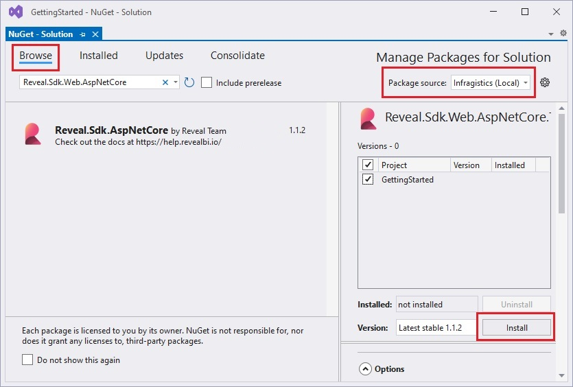
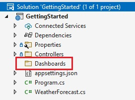

# Configuring an ASP.NET Core Server

## Install

The steps below describe how to install the Reveal SDK into an existing ASP.NET Core project.

1 - Right click the Solution, or Project, and select **Manage NuGet Packages** for Solution.


2 - In the package manager dialog, open the **Browse** tab, select the **Infragistics (Local)** package source, and install the **Reveal.Sdk.Web.AspNetCore** NuGet package into the project.



:::info

If you are a trial user, you can install the **Reveal.Sdk.Web.AspNetCore.Trial** NuGet package found on [NuGet.org](https://www.nuget.org/packages/Reveal.Sdk.Web.AspNetCore.Trial/).

:::

3 - Open and modify the `Program.cs` file to add the namespace `using Reveal.Sdk;`. Then, add the call to `IMcvBuilder.AddReveal()` to the existing `builder.Services.AddControllers()` method as follows:

```cs
using Reveal.Sdk;

builder.Services.AddControllers().AddReveal();
```

4 - Right-click the project and select **Add -> New Folder**. The folder MUST be named **Dashboards** .



By default, the Reveal SDK uses a convention that will load all dashboards from the **Dashboards** folder. You can change this convention by creating a custom `IRVDashboardProvider`. You can learn more about this in the [Loading Dashboards](loading-dashboards.md) topic.

## Export

In order to export dashboards to **Image**, **PDF** or **PowerPoint** (either programmatically or through user interaction) the Reveal SDK uses [Playwright](https://playwright.dev/dotnet/) internally.

By default, the first time an end-user tries to export a dashboard to an image, PDF or PowerPoint, Playwright will try to download the Chromium browser to the server in the default location for the current platform. For Windows, the default path is **%userprofile%/AppData/Local/ms-playwright**.

This download may take some time to complete and cause a delay for the first end-user that tries to export a dashboard. This is ok during development, but may not be desirable in a production environment. For these scenarios you can use the settings below to fine tune the Export behavior.

These settings are exposed through the `RevealEmbedSettings.Export` property.
- CreateChromiumInstancesOnDemand - set this to false to force Playwright initialization to happen on app startup
- ChromiumDownloadFolder - the path where the Chromium executables will be downloaded
- ChromiumExecutablePath - the path where the Chromium executables have been preinstalled on the server.
- MaxConcurrentExportingThreads - the number of max concurrent threads used for exporting
- ExportingTimeout - the timeout period, in milliseconds, for an export operation. Default value is 30000 ms. If an export operation does not finish within the specified timeout period, the export operation will fail.

To manually install Playwright and Chromium on the server, use the [Playwright CLI](https://playwright.dev/dotnet/docs/cli):

```bash
dotnet tool install --global Microsoft.Playwright.CLI
playwright install chromium
```

## Logging
To enable logging for the Reveal SDK, add a `"Reveal.Sdk": "Debug"` entry into the appsettings.json file.
```json title="appsettings.json"
{
  "Logging": {
    "LogLevel": {
      "Default": "Information",
      "Microsoft": "Warning",
      "Microsoft.Hosting.Lifetime": "Information",
      "Reveal.Sdk": "Debug"
    }
  },
}
```
