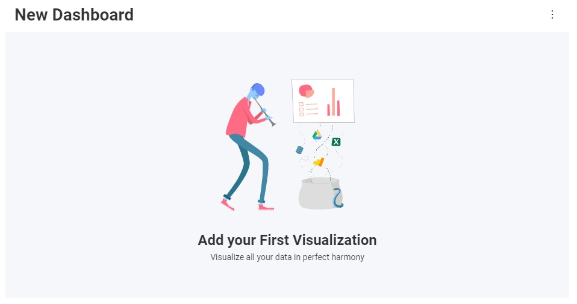

# Creating Dashboards

Creating new dashboards is really easy. You just need to set the `$.ig.RevealView.Dashboard` property to a new instance of a `$.ig.RVDashboard` object.

Start by defining a `<div>` element with the `id` set to `revealView`:
```html
<div id="revealView" style="height: 800px; width: 100%;"></div>
```

Next, in JavaScript, set the `$.ig.RevealView.Dashboard` property to a new instance of a `$.ig.RVDashboard` object:
```js
var revealView = new $.ig.RevealView("#revealView");
revealView.dashboard = new $.ig.RVDashboard();
```

Run the application and you will be prompted with a new, empty, dashboard.



As you can see, while this gives you a new dashboard instance to use, unless you have provided a data source to the `$.ig.RevealView` for your dashboard to use, your end-users will not be able to create any new visualizations in the new dashboard.

Next steps:
- [Adding Datasources](adding-data-sources/in-memory-data.md)
- [Loading Dashboards](loading-dashboards.md)