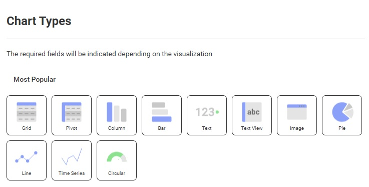
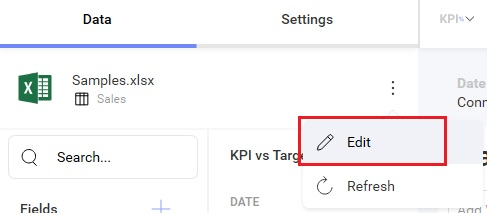

# Editing Dashboards

While editing dashboards is primarily an end-user function, there are a number of APIs available to help developers respond to different editing events, control the editing experience by showing/hiding UI elements, or disable editing altogether.

## Properties

### AvailableChartTypes

This property is used to define which chart types are available to end-users for creating and editing visualizations.



Only the chart types in the `RevealView.AvailableChartTypes` collection will be displayed to the end-user.

By default, all supported chart types are available. You can remove specific chart types by using the `AvailableChartTypes.Remove` method and passing the `RVChartType` you want to remove as a parameter.

This sample removes the `RVChartType.Indicator` and `RVChartType.IndicatorTarget` (also known as KPIs) from the `RevealView.AvailableChartTypes`.
```cs
_revealView.AvailableChartTypes.Remove(RVChartType.Indicator);
_revealView.AvailableChartTypes.Remove(RVChartType.IndicatorTarget);
```

Sometimes, when working with a small number of chart types, it's easier to remove all chart types and add only the charts you wish to make available. To do this, make sure to call the `AvailableChartTypes.Clear` method to remove all chart types, then use the `AvailableChartTypes.Add` method to add only the chart types you want to make available to your users.
```cs
_revealView.AvailableChartTypes.Clear();
_revealView.AvailableChartTypes.Add(RVChartType.BarChart);
_revealView.AvailableChartTypes.Add(RVChartType.ColumnChart);
```

The `RVChartType` enum has The following values:
- AreaChart
- BarChart
- BubbleChart
- BulletGraph
- CandlestickChart
- Choropleth
- ColumnChart
- ComboChart
- DIY
- DoughnutChart
- FunnelChart
- Grid
- Image
- Indicator
- IndicatorTarget
- LabelGauge
- LineChart
- LinearGauge
- OHLC_Chart
- PieChart
- Pivot
- RadialGauge
- RadialLineChart
- ScatterChart
- ScatterMap
- ScriptPython
- ScriptR
- Sparkline
- SplineChart
- SplineAreaChart
- StackedAreaChart
- StackedBarChart
- StackedColumnChart
- StepAreaChart
- StepLineChart
- TextBox
- TextView  
- TimeSeriesChart
- TreeMap

:::info

If you invoke the `AvailableChartTypes.Clear` method, but do not add any chart types to the collection, then all supported chart types will still be available.

:::

### CanAddCalculatedFields

This property shows/hides the **Calculated Field** menu item for the Visualization Editor.


```xml
<rv:RevealView x:Name="_revealView" CanAddCalculatedFields="False" />
```

### CanAddDashboardFilter

This property shows/hides the **Add Dashboard Filter** menu item for the Dashboard.


```xml
<rv:RevealView x:Name="_revealView" CanAddDashboardFilter="False" />
```

### CanAddDateFilter

This property shows/hides the **Add Date Filter** menu item for the Dashboard.


```xml
<rv:RevealView x:Name="_revealView" CanAddDateFilter="False" />
```

### CanAddPostCalculatedFields

This property shows/hides the **F(x)** menu item in the "Visualization Fields" section of the Visualization Editor.


```xml
<rv:RevealView x:Name="_revealView" CanAddPostCalculatedFields="False" />
```

### CanCopyVisualization

This property shows/hides the **Copy** menu item for a Visualization.


```xml
<rv:RevealView x:Name="_revealView" CanCopyVisualization="False" />
```

### CanDuplicateVisualization

This property shows/hides the **Duplicate** menu item for a Visualization.


```xml
<rv:RevealView x:Name="_revealView" CanDuplicateVisualization="False" />
```

### CanEdit

This property shows/hides the **Edit** menu item for the Dashboard.


```xml
<rv:RevealView x:Name="_revealView" CanEdit="False" />
```

When the `RevealView.CanEdit` property is set to `false`, dashboard editing is completely disabled.

### ShowEditDataSource

This property shows/hides the **Edit** menu item for the DataSource in the Visualization Editor.



```xml
<rv:RevealView x:Name="_revealView" ShowEditDataSource="False" />
```

### StartInEditMode

When set to `true`, this property will place the `RevealView` into "Edit Mode" when a dashboard is first loaded.


```xml
<rv:RevealView x:Name="_revealView" StartInEditMode="True" />
```

### StartWithNewVisualization

When set to `true`, this property will immediately launch the "New Visualization" dialog prompting you to choose a data source.


```xml
<rv:RevealView x:Name="_revealView" StartWithNewVisualization="False" />
```

:::info

This property will not function if you are loading an existing dashboard and have not set the `RevealView.StartInEditMode` property to `true` 

:::

## Events

### VisualizationEditorOpening

There may be times when you want to execute some application logic **before** the visualization editor has opened, and you may want to even prevent the editor from opening until a condition is met. To do this, you can add an event handler to the `RevealView.VisualizationEditorOpening` event.

```cs
<rv:RevealView x:Name="_revealView"
               VisualizationEditorOpening="RevealView_VisualizationEditorOpening"/>
```

```cs
private void RevealView_VisualizationEditorOpening(object sender, VisualizationEditorOpeningEventArgs e)
{
            
}
```

The `VisualizationEditorOpeningEventArgs` contains the following properties:
- **Cancel** - gets or sets a value indicating whether the event should be canceled. `true` if the event should be canceled; otherwise `false`
- **IsNewVisualization** - if `true`, the visualization is a newly added visualization. If `false`, it is an existing visualization
- **Visualization** - the visualization that was edited and/or added

:::info

If you set `e.Cancel` to `true`, then the Visualization Editor will not open.

:::

### VisualizationEditorOpened

If you would like to be notified **after** the Visualization Editor has been opened, either when editing an existing visualization or creating a new one, you can add an event handler to the `RevealView.VisualizationEditorOpened` event.

```cs
<rv:RevealView x:Name="_revealView"
               VisualizationEditorOpened="RevealView_VisualizationEditorOpened"/>
```

```cs
private void RevealView_VisualizationEditorOpened(object sender, VisualizationEditorOpenedEventArgs e)
{
            
}
```

The `VisualizationEditorOpenedEventArgs` contains the following properties:
- **IsNewVisualization** - if `true`, the visualization is a newly added visualization. If `false`, it is an existing visualization
- **Visualization** - the visualization that was edited and/or added

### VisualizationEditorClosing

There may be times when you want to execute some application logic **before** the visualization editor has closed, and you may want to even prevent the editor from closing until a condition is met. To do this, you can add an event handler to the `RevealView.VisualizationEditorClosing` event.

```xml
<rv:RevealView x:Name="_revealView"
               VisualizationEditorClosing="RevealView_VisualizationEditorClosing" />
```

```cs
private void RevealView_VisualizationEditorClosing(object sender, VisualizationEditorClosingEventArgs e)
{

}
```

The `VisualizationEditorClosedEventArgs` contains the following properties:
- **Cancel** - gets or sets a value indicating whether the event should be canceled. `true` if the event should be canceled; otherwise `false`
- **IsNewVisualization** - if `true`, the visualization is a newly added visualization. If `false`, it is an existing visualization
- **ResetVisualization** - if `true`, resets the visualization back to the state prior to being edited.
- **Visualization** - the visualization that was edited and/or added

:::info

If you set `e.Cancel` to `true`, then the Visualization Editor will not close.

:::

### VisualizationEditorClosed
Anytime an end-user edits a single visualization in the `RevealView`, the `RevealView.VisualizationEditorClosed` event is fired **after** the editor is closed. This can be in response to editing an existing visualization, or adding a new visualization. You can respond to this event by adding an event handler to the `RevealView.VisualizationEditorClosed` event.

```xml
<rv:RevealView x:Name="_revealView"
               VisualizationEditorClosed="RevealView_VisualizationEditorClosed" />
```

```cs
private void RevealView_VisualizationEditorClosed(object sender, VisualizationEditorClosedEventArgs e)
{

}
```

The `VisualizationEditorClosedEventArgs` contains the following properties:
- **IsCancelled** - determines if the visualization editor was closed via the **X button** (`false`) or the **Check Button** (`true`)
- **IsNewVisualization** - if `true`, the visualization is a newly added visualization. If `false`, it is an existing visualization
- **Visualization** - the visualization that was edited and/or added

### Dashboard.PropertyChanged

You can be notified of property value changes on the `RVDashboard` object by adding an event handler to the `RVDashboard.PropertyChanged` event.

```cs
_revealView.Dashboard.PropertyChanged += Dashboard_PropertyChanged;
```

```cs
private void Dashboard_PropertyChanged(object sender, System.ComponentModel.PropertyChangedEventArgs e)
{

}
```

Changes to values in the following properties will invoke the `RVDashboard.PropertyChanged` event:
- **DateFilter** - the dashboard date filter. For more information read the [Filtering](filtering-dashboards.md#date-filter) topic.
- **HasPendingChanges** - returns `true` if changes have been made to the current dashboard; otherwise `false`
- **Title** - the title of the Dashboard that is displayed in the `RevealView`

When dashboards are modified, the `RVDashboard.HasPendingChanges` property is updated to reflect if there are changes that have been made to the dashboard that have not yet been saved or committed.  You may use this property to notify UI elements in your application to update their enabled/disables state based on the value of the `RVDashboard.HasPendingChanges` property. To do this, add an event handler to the `RVDashboard.PropertyChanged` event, and check the `e.PropertyName`. If the property name is **HasPendingChanges** you can get the value from the dashboard and run logic based on your requirements.

```cs
private void Dashboard_PropertyChanged(object sender, System.ComponentModel.PropertyChangedEventArgs e)
{
    if (e.PropertyName == "HasPendingChanges")
    {
        var hasPendingChanges = ((RVDashboard)sender).HasPendingChanges;
    }
}
```

:::info:

When using the `RVDashboard.PropertyChanged` event, be sure to unsubscribe from the event before you load a new dashboard or discard the existing dashboard. Otherwise you could introduce memory leaks into your application.

:::