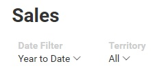
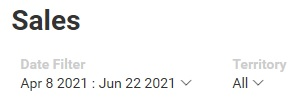

# Filtering Dashboards

Filters are located along the top of a Dashboard and can be modified using the Reveal SDK.


There are two kinds of filters:
- The Date Filter
- Dashboard Filters

## Date Filter
The **Date Filter** is a special kind of filter as it does not have any data associated with it. There’s not a list of values to select from, instead you select a date interval or range. You can choose from a list of predefined date intervals such as "Today", “All Time”, “Previous Month”, or specify your own custom range (from Jan 12, 2019 to Jan 12, 2021).

The **Date Filter** is always the first filter and there can be only **one** Date Filter.


### Using a Date Interval
To set the dashboard's **Date Filter** using a predefined set of date intervals, you must set the `Dashboard.DateFilter` property to a new instance of a `RVDateDashboardFilter` object and use the appropriate `RVDateFilterType` value as a parameter.

For example; this code snippet will set the dashboard's date filter to **YearToDate**:
```cs
_revealView.Dashboard.DateFilter = new RVDateDashboardFilter(RVDateFilterType.YearToDate);
```
Here you can see the dashboard UI updated it's Date Filter to **Year To Date**



The `RVDateFilterType` has the following values:
- AllTime
- CustomRange
- LastMonth
- LastWeek
- LastYear
- MonthToDate
- NextMonth
- NextQuarter
- NextYear
- PreviousMonth
- PreviousQuarter
- PreviousYear
- QuarterToDate
- ThisMonth
- ThisQuarter
- ThisYear
- Today
- TrailingTwelveMonths
- YearToDate
- Yesterday
  
### Using a Custom Date Range
To set a custom date range, you must set the `Dashboard.DateFilter` property to a new instance of a `RVDateDashboardFilter` object, and use the `RVDateFilterType.CustomRange` value as a parameter and provide a `RVDateRange` (which provides the fromDate and toDate arguments) as the second parameter.

In this example, we set the `DateFilter` to a custom date range spanning the last 75 days:
```cs
_revealView.Dashboard.DateFilter = new RVDateDashboardFilter(RVDateFilterType.CustomRange,
     new RVDateRange(DateTime.Now.AddDays(-75), DateTime.Now)
));
```

Here you can see the dashboard UI updated it's Date Filter to display the date range



:::info Get the Code

You can find a sample demonstrating Date Filters on [GitHub](https://github.com/RevealBi/sdk-samples-wpf/tree/master/FilteringDashboards-Dates).

:::

## Dashboard Filters

**Dashboard Filters** are displayed after the Date Filter, if a Date Filter is defined, and you can have multiple dashboard filters defined for a single dashboard. In this image, there are three dashboard filters defined (Territory, Employee, Product).


When working with dashboard filters, the main object you need to be aware of is the `RVDashboardFilter` object. The `RVDashboardFilter` object represents an individual filter that has been defined for a dashboard. It contains information about the filter such as the filter's title, available values to choose from, as well as what values are currently selected.

The `RVDashboardFilter` object has the following properties and methods:
- **Id** - a unique ID of the filter, usually a GUID
- **Title (1)** - the name of the filter. It is also used as the header of the filter in the dashboard filters UI
- **SelectedValues (3)** - a collection of values that have been selected for the filter. They are represented in the UI by checkboxes within the filter dropdown
- **GetFilterValuesAsync() (2)** - returns a collection of all filter values that are available for the filter. These act as options in a drop down list to choose which filter values to apply/select


### Get All Filters

Dashboard filters can be accessed by using the `RVDashboard.Filters` property. The `RVDashboard.Filters` property will return all filters that have been defined for the dashboard.
```cs
var allDashboardFilters = _revealView.Dashboard.Filters;
```

The `RVDashboard.Filters` property returns a read-only collection of `RVDashboardFilter` objects.

### Get a Specific Filter
The Reveal SDK provides an API to get a specific dashboard filter without having to loop through the `RVDashboard.Filters` property. Instead, you can use either the `RVDashboard.Filters.GetById` or the `RVDashboard.Filters.GetByTitle` method.

##### Get by Id

```cs
var territoryFilter = _revealView.Dashboard.Filters.GetById("ddf3fa65-6893-4d8b-73ad-0b28fc1af330");
```

##### Get by Title

```cs
var territoryFilter = _revealView.Dashboard.Filters.GetByTitle("Territory");
```

These methods will return a `RVDashboardFilter` object which represents a specific dashboard filter.

### Get Available Filter Values

 To get a collection of all available filter values for a dashboard filter, use the `RVDashboardFilter.GetFilterValuesAsync()` method.
```cs
var territoryFilter = _revealView.Dashboard.Filters.GetByTitle("Territory");
var filterValues = await territoryFilter.GetFilterValuesAsync();
```
The `RVDashboardFilter.GetFilterValuesAsync()` method will return a collection of `RVFilter` objects.

The `RVFilter` object has the following properties:
- **Label** - the text that is displayed in the filter dropdown UI.
- **Value** - the underlying value of the  `RVFilter` object.

### Get Selected Filter Values

To get a collection of the currently selected filter values for a dashboard filter, you can use the `RVDashboardFilter.SelectedValues` property.
```cs
var territoryFilter = _revealView.Dashboard.Filters.GetByTitle("Territory");
var selectedFilterValues = territoryFilter.SelectedValues;
```

### Set Selected Filter Values

You can programmatically set the selected value(s) for a dashboard filter by using the `RVDashboardFilter.SelectedValues` property. Simply set the `RVDashboardFilter.SelectedValues` property to a new instance of a `List<object>`. The `List<object>` instance must contain all the filter values you want to have selected within the dashboard filter.

##### Set a Single Selected Filter Value

```cs
var territoryFilter = _revealView.Dashboard.Filters.GetByTitle("Territory");
territoryFilter.SelectedValues = new List<object>() { "Japan" };
```

##### Set Multiple Selected Filters

```cs
var territoryFilter = _revealView.Dashboard.Filters.GetByTitle("Territory");
territoryFilter.SelectedValues = new List<object>() { "Japan", "India" };
```

### Clear Selected Filters

In order to clear any filter values that have been selected for a specific dashboard filter, simply set the `RVDashboardFilter.SelectedValues` property to a new empty `List<object>`.

```cs
var territoryFilter = _revealView.Dashboard.Filters.GetByTitle("Territory");
territoryFilter.SelectedValues = new List<object>();
```

:::info Get the Code

You can find a sample demonstrating Dashboard Filters on [GitHub](https://github.com/RevealBi/sdk-samples-wpf/tree/master/FilteringDashboards).

:::

## Hiding Filters
When using custom filter UI's or other custom filtering interactions, you may want to hide the panel containing the filters in the `RevealView` so the end-user won't get confused filtering the dashboard. You can hide the date and dashboard filters by setting the `RevealView.ShowFilters` property to `false`.
```cs
revealView.ShowFilters = false;
```
