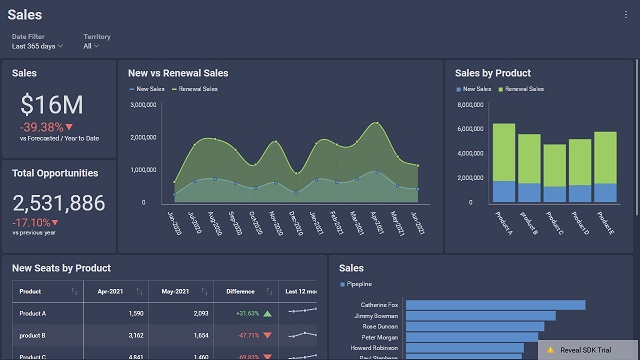
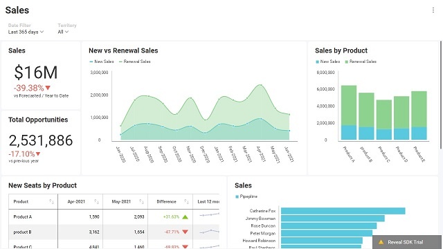

# Theming Dashboards

## Built-In Themes

Reveal SDK comes with four built-in themes that can applied:

| Theme              | RevealView                               |
| -----              | :--------:                               |
| **Mountain Light** |   |
| **Mountain Dark**  |    |
| **Ocean Light**    |     |
| **Ocean Dark**     |      |

## Apply a Theme

To apply a built-in theme, you need to assign the `RevealSdkSetting.Theme` property to an instance of your preferred theme.

##### Mountain Light

```cs
RevealSdkSettings.Theme = new MountainLightTheme();
```

##### Mountain Dark

```cs
RevealSdkSettings.Theme = new MountainDarkTheme();
```

##### Ocean Light

```cs
RevealSdkSettings.Theme = new OceanLightTheme();
```

##### Ocean Dark

```cs
RevealSdkSettings.Theme = new OceanDarkTheme();
```

:::info

The `RevealSdkSetting.Theme` property is a static property and will apply to all instances of `RevealView` in your application.

:::

## Custom Themes

When embedding the Reveal SDK into your existing applications, it is important that the dashboards match your application's look and feel. If any of the built-in Reveal SDK themes do not match your application's theme, you can create a custom theme that more closely matches your application's look and feel.

A theme is a class of type `RevealTheme`. It allows you to define colors and fonts for various elements of the the Reveal SDK UI controls.

The `RevealTheme` has the following properties:

| Name                             | Description                                                                                                    |
| ----                             | -----------                                                                                                    |
| **ChartColors**                  | The colors used to show the series in your visualizations. You can add an unlimited number of colors. Once all colors are used in a visualization, Reveal will autogenerate new shades of these colors. This way your colors won’t repeat and each value will have its own color.            |
| **AccentColor**                  | The default accent color in Reveal is a shade of blue that you can find in the + Dashboard button and other interactive actions. You can change the color to match the same accent color you use in your applications.                                                                    |
| **DashboardBackgroundColor**     | Sets the background color of the dashboards. This is the main background color.                                |
| **VisualizationBackgroundColor** | Sets the background color of the visualizations. This is a secondary background color.                         |
| **ConditionalFormatting**        | Changes the default colors of the bounds you can set when using conditional formatting.                        |
| **RegularFont**                  | Sets the regular font style.                                                                                   |
| **BoldFont**                     | Sets the bold font style.                                                                                      |
| **MediumFont**                   | Sets the medium font style.                                                                                    |
| **FontColor**                    | Sets the color of the font.                                                                                    |
| **HighlightColor**               | Sets the highlighting color in specific dashboard scenarios (forecast and outliers statistical functions).     |
| **UseRoundedCorners**            | Rounded corners in buttons, tooltips, containers, visualizations, etc. If set to false, squared corners will be shown.                                                                                                                                                                        |

:::info

When updating theme properties or applying a new theme at runtime, you must call `RevealView.RefreshTheme()` in order to have theme changes applied to the `RevealView`.

:::

### Clone Existing Theme

If you would like to create a theme based on the values of the an existing theme, you can clone the current `RevealTheme` before making making any changes to it.  To clone a theme, simply use the `RevealTheme.Clone()` method. Once you have cloned the theme, you can set the theme properties and use it as the new theme.

```cs
var clonedTheme = RevealSdkSettings.Theme.Clone();

clonedTheme.FontColor = Colors.DarkBlue;
clonedTheme.AccentColor = Colors.Green;
clonedTheme.DashboardBackgroundColor = Colors.LightYellow;
clonedTheme.VisualizationBackgroundColor = Colors.LightGray;

clonedTheme.ChartColors.Clear();
clonedTheme.ChartColors.Add(Color.FromRgb(192, 80, 77));
clonedTheme.ChartColors.Add(Color.FromRgb(101, 197, 235));
clonedTheme.ChartColors.Add(Color.FromRgb(232, 77, 137));

RevealSdkSettings.Theme = clonedTheme;

_revealView.RefreshTheme();
```

### Create a Custom Theme

If you would like a theme that is more maintainable and easier to reuse and share, we recommend creating a custom theme. A custom theme is a class that derives from `RevealTheme`.

Here is an example of a custom theme called `MyUglyTheme`:
```cs
public class MyUglyTheme : RevealTheme
{
    public MyUglyTheme()
    {
        RegularFont = new FontFamily(new Uri("pack://application:,,,/Fonts/"), "./#Wingdings 2");
        MediumFont = new FontFamily(new Uri("pack://application:,,,/Fonts/"), "./#Lucida Calligraphy");
        BoldFont = new FontFamily(new Uri("pack://application:,,,/Fonts/"), "./#CF Crack and");

        FontColor = Colors.DarkRed;
        AccentColor = Color.FromRgb(192, 80, 77);
        DashboardBackgroundColor = Colors.Black;
        VisualizationBackgroundColor = Color.FromRgb(153, 255, 255);

        ChartColors.Clear();
        ChartColors.Add(Color.FromRgb(192, 80, 77));
        ChartColors.Add(Color.FromRgb(101, 197, 235));
        ChartColors.Add(Color.FromRgb(232, 77, 137));

        UseRoundedCorners = false;
    }
}
```

After you have created your custom theme class, you can now apply the theme.

```cs
RevealSdkSettings.Theme = new MyUglyTheme();
_revealView.RefreshTheme();
```

:::info Get the Code

The source code to this sample can be found on [GitHub](https://github.com/RevealBi/sdk-samples-wpf/tree/master/ThemingDashboards)

:::