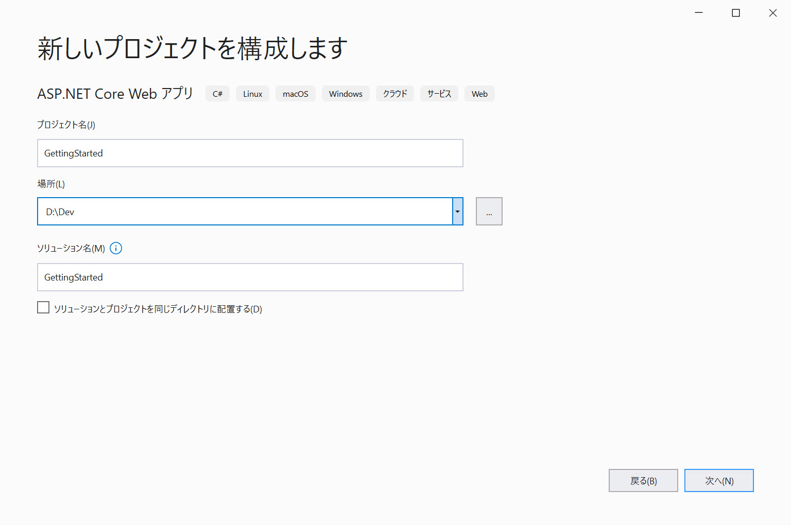
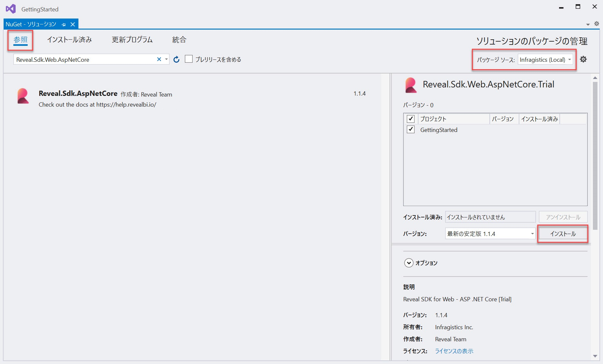

# Reveal SDK for ASP.NET で作業を開始

## 手順 1 - 手順新しい ASP.NET Web アプリの作成

以下の手順では、新しい ASP.NET Core Web App プロジェクトを作成する方法を説明します。既存のアプリケーションに Reveal SDK を追加する場合は、手順 2 へ移動します。

1 - Visual Studio 2019 を起動し、スタート ページで **[新しいプロジェクトの作成]** をクリックします。**ASP.NET Core Web App** テンプレートを選択し、**[次へ]** をクリックします。


2 - プロジェクト名と説明と場所を入力し、**[次へ]** をクリックします。



3 - フレームワーク、認証タイプ、Docker オプションを選択し、**[作成]** をクリックします。


## 手順 2 - Reveal SDK の追加

1 - ソリューションまたはプロジェクトを右クリックし、**[ソリューションの NuGet パッケージの管理]** を選択します。


2 - パッケージ マネージャー ダイアログで **[参照]** タブを開き、**Infragistics (Local)** パッケージ ソースを選択して **Reveal.Sdk.AspNetCore** NuGet パッケージをプロジェクトにインストールします。



3 - `Program.cs` ファイルを開き、`using Reveal.Sdk` 名前空間を追加します。次に、以下のように `IMcvBuilder.AddReveal()` への呼び出しを追加します。

```cs
using Reveal.Sdk;

builder.Services.AddRazorPages().AddReveal();
```

## 手順 3 - Reveal JavaScript API の追加

1 - `wwwroot/lib` フォルダーの下に `reveal` と呼ばれる新しいフォルダーを作成します。


2 - `%public%/Documents/Infragistics/Reveal/SDK/Web/JS/Client` にあるすべての JavaScript ファイルを以前作成した `wwwroot/lib/reveal` フォルダーにコピーします。


3 - `Pages/Shared/_Layout.cshtml` ファイルを開いて変更し、ページの下部に (`</body>` 終了タグの直前、`jquery.min.js` スクリプトの後) `infragistics.reveal.js` スクリプトを含めます。

```html
<script src="~/lib/reveal/infragistics.reveal.js"></script>
```

:::info

Reveal JavaScript API は、`jQuery` バージョン 2.2 以降に依存します。

:::

4 - 残りの Reveal JavaScript API 依存関係をインストールします。

- Day.js 1.8.15 またはそれ以降

```html
<script src="https://unpkg.com/dayjs@1.8.21/dayjs.min.js"></script>
```

- Quill RTE 1.3.6 またはそれ以降

```html
<link href="https://cdn.quilljs.com/1.3.6/quill.snow.css" rel="stylesheet" type="text/css">    
<script src="https://cdn.quilljs.com/1.3.6/quill.min.js"></script>
```

- Spectrum v1.8.0 またはそれ以降 (オプション) - これは、エンドユーザーが特定の表示形式の背景色を設定できるように UI を有効にする場合にのみ必要です。

``` html
<link href="https://cdnjs.cloudflare.com/ajax/libs/spectrum/1.8.0/spectrum.min.css" rel="stylesheet" type="text/css" >
<script src="https://cdnjs.cloudflare.com/ajax/libs/spectrum/1.8.0/spectrum.min.js"></script>
```

最終の `_Layout.cshtml` ファイルは以下のようになります。

```html title="Pages/Shared/_Layout.cshtml"
<!DOCTYPE html>
<html lang="en">
<head>
    <meta charset="utf-8" />
    <meta name="viewport" content="width=device-width, initial-scale=1.0" />
    <title>@ViewData["Title"] - GettingStarted</title>
    <link rel="stylesheet" href="~/lib/bootstrap/dist/css/bootstrap.min.css" />
    <link rel="stylesheet" href="~/css/site.css" asp-append-version="true" />
    <link rel="stylesheet" href="~/GettingStarted.styles.css" asp-append-version="true" />
    // highlight-next-line
    <link href="https://cdn.quilljs.com/1.3.6/quill.snow.css" rel="stylesheet" type="text/css">   
</head>
<body>
    <header>
        <nav class="navbar navbar-expand-sm navbar-toggleable-sm navbar-light bg-white border-bottom box-shadow mb-3">
            <div class="container">
                <a class="navbar-brand" asp-area="" asp-page="/Index">GettingStarted</a>
                <button class="navbar-toggler" type="button" data-bs-toggle="collapse" data-bs-target=".navbar-collapse" aria-controls="navbarSupportedContent"
                        aria-expanded="false" aria-label="Toggle navigation">
                    <span class="navbar-toggler-icon"></span>
                </button>
                <div class="navbar-collapse collapse d-sm-inline-flex justify-content-between">
                    <ul class="navbar-nav flex-grow-1">
                        <li class="nav-item">
                            <a class="nav-link text-dark" asp-area="" asp-page="/Index">Home</a>
                        </li>
                        <li class="nav-item">
                            <a class="nav-link text-dark" asp-area="" asp-page="/Privacy">Privacy</a>
                        </li>
                    </ul>
                </div>
            </div>
        </nav>
    </header>
    <div class="container">
        <main role="main" class="pb-3">
            @RenderBody()
        </main>
    </div>

    <footer class="border-top footer text-muted">
        <div class="container">
            &copy; 2022 - GettingStarted - <a asp-area="" asp-page="/Privacy">Privacy</a>
        </div>
    </footer>

    // highlight-start
    <script src="~/lib/jquery/dist/jquery.min.js"></script>
    <script src="~/lib/bootstrap/dist/js/bootstrap.bundle.min.js"></script>
    <script src="~/js/site.js" asp-append-version="true"></script>

    <script src="https://unpkg.com/dayjs@1.8.21/dayjs.min.js"></script>
    <script src="https://cdn.quilljs.com/1.3.6/quill.min.js"></script>
    <script src="~/lib/reveal/infragistics.reveal.js"></script>
    // highlight-end

    @await RenderSectionAsync("Scripts", required: false)
</body>
</html>
```

## 手順 4 - Reveal ビューの初期化

1 - `Pages/Index.cshtml` ファイルを開いて変更し、新しい `<div>` タグを追加して、`id` を `revealView` に設定します。

```html
<div id="revealView" style="height: 800px; width: 100%;"></div>
```

2 - `Index.cshtml` ファイルの最後に `Scripts` セクションを追加し、`revealView` を初期化します。

```html
@section Scripts
{
    <script type="text/javascript">
        // highlight-next-line
        var revealView = new $.ig.RevealView("#revealView");
    </script>
}
```

この JavaScript コードは最初に `$.ig.RevealSdkSettings.ensureFontsLoadedAsync` を呼び出してすべてのフォントが正しく読み込まれたことを確認します。次に、新しい `$.ig.RevealView` を作成し、`#revealView` セレクターを渡すことで、`RevealView` の新しいインスタンスを作成します。

最終の `Index.cshtml` ファイルは以下のようになります。

```html
@page
@model IndexModel
@{
    ViewData["Title"] = "Home page";
}

// highlight-next-line
<div id="revealView" style="height: 800px; width: 100%;"></div>

@section Scripts
{
    <script type="text/javascript">
        // highlight-next-line
        var revealView = new $.ig.RevealView("#revealView");
    </script>
}
```
## 手順 5 - アプリケーションの実行

**[F5]** を押してアプリケーションを実行します。


完了しました! 最初の Reveal SDK アプリケーションを作成しました。

次の手順:
- [新しいダッシュボードの作成](creating-dashboards.md)
- [既存のダッシュボードの読み込み](loading-dashboards.md)

:::info Get the Code

このサンプルのソース コードは [GitHub](https://github.com/RevealBi/sdk-samples-aspnetcore/tree/main/01-GettingStarted-WebApp) にあります。

:::