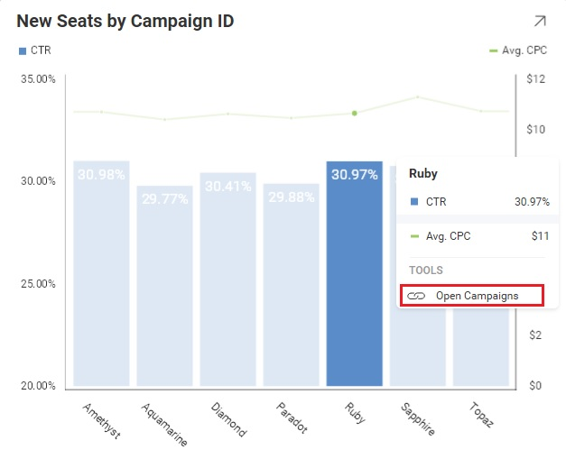

# Linking Dashboards

The Reveal SDK supports dashboard linking, which allows users to navigate through dashboards. By moving from dashboard to dashboard, you can go from a high level overview of the business' reality to a more detailed view with the specifics.

From a Reveal SDK perspective, dashboard linking is invoked when an end-user clicks on a link in a visualization which invokes the loading of another dashboard.



:::info

Currently, dashboard links cannot be created with the Reveal SDK. You must use a native Reveal application such as [Slingshot](https://my.slingshotapp.io/)

:::

## Respond to a Dashboard Link

To respond to when a **Dashboard Link** is clicked within a dashboard, you must set the property `RevealView.onLinkedDashboardProvider ` to a method that returns the `RVDashboard.loadDashboardAsync` Promise that loads the dashboard.

Using the dashboard Id:
```js
revealView.onLinkedDashboardProviderAsync = (dashboardId, title) => {
    return $.ig.RVDashboard.loadDashboardAsync(dashboardId);
};
```

The dashboard Id is auto-generated if the dashboard was created in the [Reveal App](https://app.revealbi.io/). The dashboard Id may not be used in your scenario. For this reason, you can use the dashboard title instead.

Using the dashboard title:
```js
revealView.onLinkedDashboardProviderAsync = (dashboardId, title) => {
    return $.ig.RVDashboard.loadDashboardAsync(title);
};
```

The dashboard title is actually the file name of the dashboard .rdash file that is hosted on the server.

:::info Get the Code

The source code to this sample can be found on [GitHub](https://github.com/RevealBi/sdk-samples-javascript/tree/master/LinkingDashboards)

:::