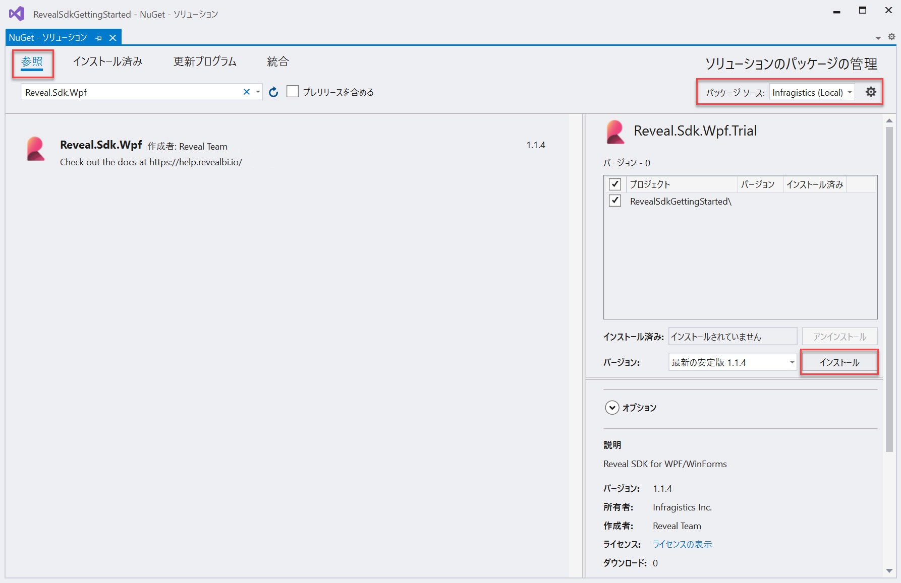
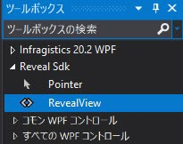
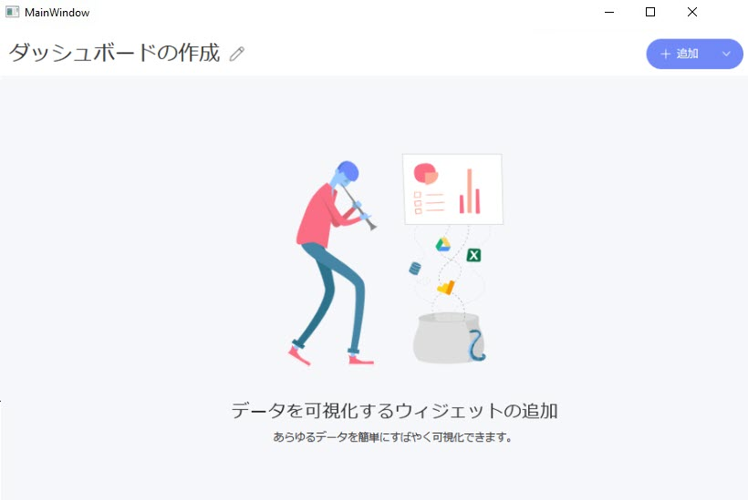

# Reveal SDK を使用した作業の開始

## 手順 1 - 新しい WPF プロジェクトの作成
以下の手順では、新しい WPF プロジェクトを作成する方法を説明します。既存のアプリケーションに Reveal SDK を追加する場合は、[手順 2](#step-2---add-reveal-sdk) へ移動します。

1 - Visual Studio 2019 を起動し、スタート ページで **[新しいプロジェクトの作成]** をクリックします。**WPF App (.NET Framework)** テンプレートを選択し、**[次へ]** をクリックします。


2 - プロジェクト名を入力し、**.NET Framework 4.6.2** 以上を選択し、**[作成]** をクリックします。


## 手順 2 - Reveal SDK の追加

### NuGet

1 - ソリューションまたはプロジェクトを右クリックし、**[ソリューションの NuGet パッケージの管理]** を選択します。


2 - パッケージ マネージャー ダイアログで **[参照]** タブを開き、**Infragistics (Local)** パッケージ ソースを選択して **Reveal.Sdk.Wpf** NuGet パッケージをプロジェクトにインストールします。



:::info

トライアル版をお使いの場合、[NuGet.org](https://www.nuget.org/packages/Reveal.Sdk.Wpf.Trial/) にある **Reveal.Sdk.Wpf.Trial** NuGet パッケージをインストールできます。

:::

### 手動

1 - ソリューション エクスプローラーの [参照] ノードを右クリックし、**[参照の追加]** を選択します。


2 - **[参照]** ボタンをクリックし、インストーラーが **%public%\Documents\Infragistics\Reveal\SDK\WPF\Binaries** でドロップしたすべてのアセンブリを選択します。


3 - Reveal SDK が依存する以下の NuGet パッケージをインストールします。
   1. CefSharp.Wpf (87.1.132 またはそれ以降) 
   2. SkiaSharp (1.68.0 またはそれ以降)
   3. System.Data.SQLite.Core (1.0.108 またはそれ以降)
   4. Microsoft.Data.SqlClient (1.1.3 またはそれ以降)

## 手順 3 - RevealView コントロールの追加

### XAML の使用

1 - **MainWindow.xaml** ファイルを開き、`xmlns:rv="http://revealbi.io/"` 名前空間を追加します。

```xml
xmlns:rv="http://revealbi.io/"
```

2 - RevealView を MainWindow のコンテンツに追加します。

```xml
<rv:RevealView />
```

### ツールボックスの使用

1 - **MainWindow.xaml** ファイルを開きます。

2 - Visual Studio のツールボックスを開き、**[Reveal SDK]** ツールボックス タブの下にある **[RevealView]** コントロールに移動します。



3 - **RevealView** コ ントロールをクリックして、**MainWindow.xaml** ファイルのデザイン サーフェス上にドラッグします。Reveal SDK 名前空間と RevealView コントロールの両方が MainWindow.xaml ファイルに追加されます。


## 手順 4 - アプリケーションの実行

[F5] を押してアプリケーションを実行します。



完了しました! 最初の Reveal SDK アプリケーションを作成しました。

次の手順:
- [新しいダッシュボードの作成](creating-dashboards.md)
- [既存のダッシュボードの読み込み](loading-dashboards.md)

:::info Get the Code

このサンプルのソース コードは [GitHub](https://github.com/RevealBi/sdk-samples-wpf/tree/master/01-GettingStarted) にあります。

:::